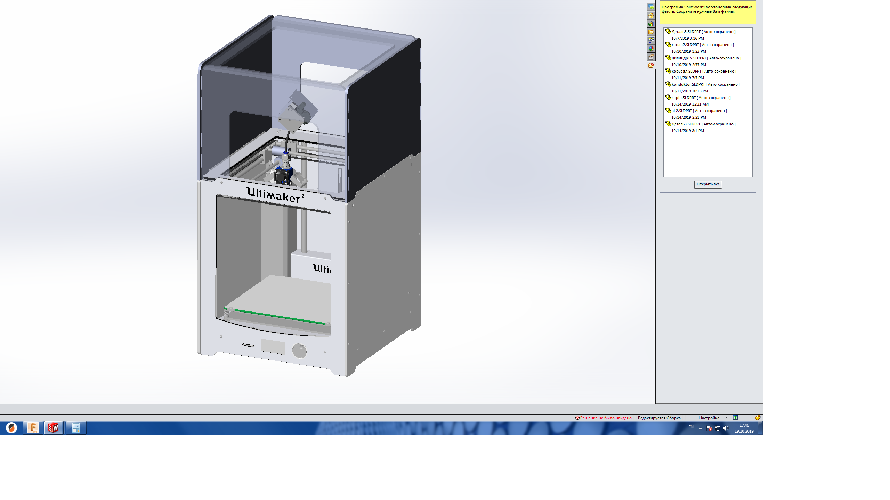

# um2-suspended-extruder
Ultimaker 2 with suspended extruder and short Bowden tube to maximize throughput

# Why?
Recent research (TBD! Paper by Kuznetsov, Urzhumtsev et al to appear here) showed that long Bowden tubes inflict high extrusion resistance and limit the effective printing speed.
Moreover, the performance decreases over time, since there are scratches appearing inside the tube.

# What?

# How?
The parts should be cut out of sheet material of 6 mm thickness. We used aluminum and polymer composite ("sandwich"), but it is also possible tu use acrylic, plywood etc.
All other necessary preparations, e.g. new hot end, extruder and suspension will be described in the [paper](#).
